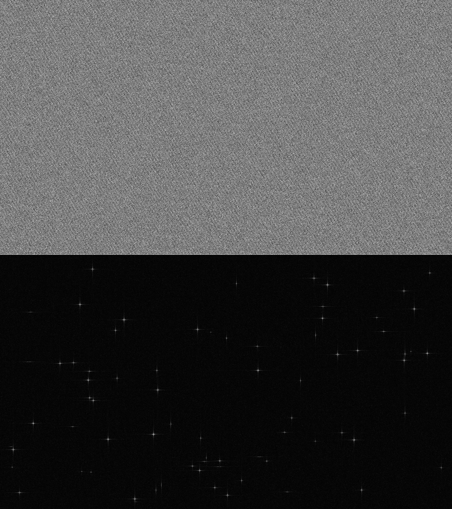
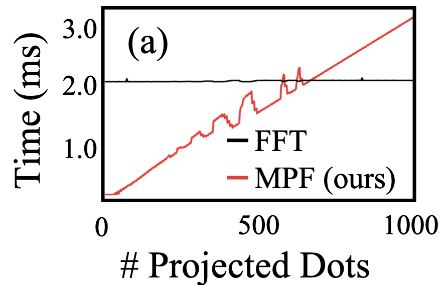

# <p align="center">Energy-Efficient Adaptive 3D Sensing [CVPR 2023]</p>

<p align="center">
  <a href="https://btilmon.github.io/">Brevin Tilmon</a><sup>1</sup>,
  <a href="https://zhsun0357.github.io/">Zhanghao Sun</a><sup>2</sup>,
  <a href="https://focus.ece.ufl.edu/people/">Sanjeev Koppal</a><sup>1</sup>,
  <a href="https://yichengwu.github.io/">Yicheng Wu</a><sup>3</sup>, <br>
  <a href="https://sites.google.com/site/georgeevangelidis/">Georgios Evangelidis</a><sup>3</sup>,
  <a href="https://www.linkedin.com/in/ramzi-zahreddine-42a09b87/">Ramzi Zahreddine</a><sup>3</sup>,
  <a href="https://www.linkedin.com/in/krishnanguru/">Guru Krishnan</a><sup>3</sup>,
  <a href="https://sizhuoma.netlify.app/">Sizhuo Ma</a><sup>3</sup>, 
  <a href="https://jianwang-cmu.github.io/">Jian Wang</a><sup>3</sup> <br>
  University of Florida<sup>1</sup>, Stanford University<sup>2</sup>, Snap Research<sup>3</sup>
</p>

### <p align="center">Paper (Coming Soon) | [Project Page](https://btilmon.github.io/e3d.html)</p>


This repository contains a CUDA implementation/simulator for the holographic projector introduced in our "Energy Efficient Adaptive 3D Sensing" paper in CVPR 2023. The implementation enables real-time sparse hologram generation on embedded NVIDIA GPUs, such as the Tegra X1, as well as on most other NVIDIA GPUs. A holographic projector can be considered a software-defined 3D sensor. The hologram of the desired projector pattern is computed in software and subsequently displayed on a spatial light modulator, which then diffracts light to form the hologram within the scene. A key property of holographic projectors is their ability to redistribute light. This means that as the number of hologram points increases, the intensity of each point decreases, since the laser light must be shared among all points. We leverage this light redistribution property to achieve higher signal-to-noise ratios (SNR) and accuracy in active depth sensing compared to state-of-the-art 3D sensors, such as EpiScan3D and Microsoft Kinect/Intel RealSense. Our approach is validated in simulation and on a real Holoeye GAEA 1 Spatial Light Modulator using this repository. The 3D sensors shown below are adaptive (our method), line scanning (EpiScan3D), and full frame (Kinect/Intel RealSense), displayed from left to right. The images from top to bottom represent estimated phase, simulated hologram, and the actual hologram from a spatial light modulator.


<div style="display: flex; justify-content: center;">
  <div style="text-align: center;">
    <p align="center"></p>
  </div>
</div>

## CVPR 2023 Demo Video [(High Resolution Youtube Link)](https://www.youtube.com/watch?v=31lPWl-AU_w&feature=youtu.be)
<p align="center">This is a demo of real-time adaptive active stereo with our holographic projector using the full version of holoCu. The demo runs self contained on a NVIDIA Jetson Nano (Tegra X1 embedded GPU). See the YouTube link for a higher resolution demo.</p>

<div style="display: flex; justify-content: center;">
  <div style="text-align: center;">
    <p align="center"></p>
  </div>
</div>

## Dependencies
There are full and headless versions. The full version renders hologram information to either a monitor or SLM using OpenGL-CUDA interop, and the headless version simply renders hologram information to an image with no hardware required. You only need to install OpenGL for the full version.

* CUDA (Tested on CUDA Toolkit 10.2, CUDA Toolkit includes cuFFT and cuComplex)
* OpenGL (Only needed for full version.)
    * ```sudo apt-get install freeglut3-dev```
    * ```sudo apt-get install libglfw3-dev```


We tested on:
  * Tegra X1 GPU on NVIDIA Jetson Nano, Ubuntu 18.04 provided from Jetson Nano Developer Kit SD Card Image. We overclocked both CPU and GPU using ```sudo jetson-clocks```.
  * GTX 1660, Ubuntu 18.04

## Headless Version
OpenGL is not required for the headless version. The hologram phase and simulated hologram amplitude are saved to an image as ```data/<projector>.png```. After installing CUDA the hologram phase and simulated hologram amplitude can be computed after running:

```bash
mkdir build
cd build
cmake -DBUILD_OPENGL=OFF ..
make
cd ../src/
bash headless.sh
```

It should look like this:

```console
btilmon@linux:~$ bash headless.sh

Running headless version. Phase and simulated hologram will be saved to 'holoCu/data/'.

Sensor Settings: 
----------------
Sensor:              adaptive
N:                   75
Hologram Size (HxW): 1080x1920
SLM Size (HxW):      1080x1920


3D Sensor SNR:
--------------
Adaptive (Ours):               c75
Line Scanning (EpiScan3D):     c7.21688
Full Frame (Kinect/RealSense): c 


Runtimes (ms):
--------------
Phase Computation:    0.375219
Hologram Simulation:  1.02681
Total:                1.40202

```

Here is an example saved image with the hologram phase on top and simulated hologram amplitude on bottom:

<p align="left">
  
</p>


## Full Version

OpenGL is required to display hologram information for the full version. If using a phase only spatial light modulator instead of a monitor, or just for visualization/debugging on a monitor, set ```--display="phase"``` in ```full.sh``` to display the hologram phase instead of the simulated hologram amplitude. Set ```--display="hologram"``` to display the simulated hologram for visualization on a monitor. After installing CUDA and OpenGL the selected hologram information should render to screen after running:

```bash
mkdir build
cd build
cmake -DBUILD_OPENGL=ON ..
make
cd ../src/
bash full.sh
```

It should look like this if using a line projector and displaying the simulated hologram. This is with GTX 1660:

```console
btilmon@linux:~$ bash full.sh

Running full version. Either phase or simulated hologram will be displayed on your monitor/SLM.

Sensor Settings: 
----------------
Sensor:              line
N:                   75
Hologram Size (HxW): 1080x1920
SLM Size (HxW):      1080x1920


3D Sensor SNR:
--------------
Adaptive (Ours):               c75
Line Scanning (EpiScan3D):     c7.21688
Full Frame (Kinect/RealSense): c 

HDMI-0
Frame buffer size: 1920 x 1080

GPU Device 0: "Turing" with compute capability 7.5

Runtimes (ms):
--------------
Phase Computation:    0.871509
Hologram Simulation:  1.01298
Render to Screen:     0.805597
Total:                2.69008

```

**See our adaptive active stereo demo at the top of the README for an example of what the full version can do.** If just visualizing on a monitor though, here is an example of visualizing the simualted line holograms on a monitor with the full version:

<p align="left">
  
</p>


## Projectors

In our paper we compare different 3D sensing techniques including full frame (such as Kinect and Intel RealSense) and line scanning (such as EpiScan3D) to our proposed adaptive approach. An adaptive projector is used by default, set ```--projector="line"``` to use line scanning projector or ```--projector="fullFrame"``` for full frame projector instead in ```<full, headless>.sh```. 

## Benchmarks

Our fused CUDA implementation of Fresnel Holography (pointwise integration of diffractive patterns for each hologram point) is faster than Fourier Holography (taking the FFT of a desired projector image) for sparse holograms (~500 hologram points on GTX 1660, ~75 on Tegra X1), even when using the heavily optimized cuFFT for Fourier Holography. In the figure, we used GTX 1660, and MPF stands for Mirror Phase Function which is our Fresnel Holography approach, and FFT stands for Fourier Holography.

<p align="left">
  
</p>

## Citation

If you found our code useful, please cite our paper:
```bibtex
@inproceedings{tilmon2023e3d,
  title     = {Energy-Efficient Adaptive 3D Sensing},
  author    = {Tilmon, Brevin and Sun, Zhanghao and Koppal, Sanjeev and Wu, Yicheng and Evangelidis, Georgios and Zahreddine, Ramzi and Krishnan, Guru and Ma, Sizhuo and Wang, Jian},
  booktitle = {Proceedings of the IEEE/CVF Conference on Computer Vision and Pattern Recognition (CVPR)},
  month     = {June},
  year      = {2023},
}
```
